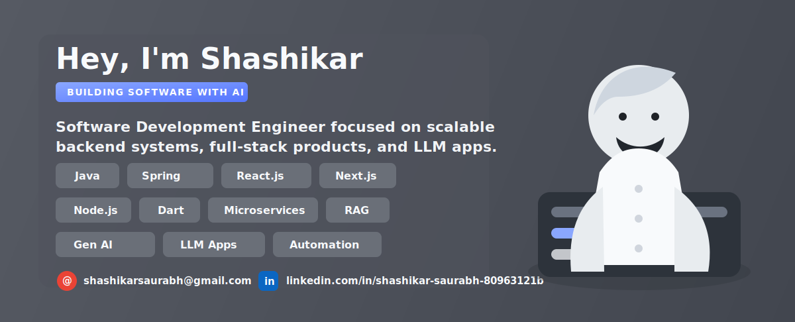

<p align="center">
  
</p>

```ts
@Controller('recruiters')
export class ShashikarSaurabhProfile {
  constructor(private readonly builder: ProductEngineeringService) {}

  @Get('software-development-engineer')
  createImpact() {
    return this.builder.execute({
      name: 'Shashikar Saurabh',
      role: 'Software Development Engineer',
      backend: ['Java', 'Spring Boot', 'Microservices', 'Node.js'],
      frontend: ['React.js', 'Next.js', 'JavaScript'],
      mobile: ['Dart'],
      ai: ['AI Automation', 'Generative AI', 'LLM Applications', 'RAG'],
      focus2026: ['Cloud-native APIs', 'System Design', 'Agentic Workflows'],
      contact: 'shashikarsaurabh@gmail.com',
      linkedin: 'https://www.linkedin.com/in/shashikar-saurabh-80963121b/',
      leetcode: 'https://leetcode.com/u/shashikarsaurabh/'
    });
  }
}
```

## About Me

Software Development Engineer focused on building scalable backend systems, polished full-stack products, and AI-powered applications. I enjoy turning complex problems into clean APIs, useful interfaces, and automation workflows that feel production-ready.

## Tech Stack

`Java` `Spring Boot` `Microservices` `React.js` `Next.js` `Node.js` `JavaScript` `Dart` `REST APIs` `SQL` `Docker` `Git` `AI Automation` `Generative AI` `LLM Applications` `RAG`

## Current Focus

- Strengthening Java, Spring Boot, React.js, Next.js, and Node.js system design for scalable SDE roles.
- Building microservices and full-stack projects that solve real user problems.
- Exploring AI automation, Generative AI, LLM applications, RAG, and agentic workflows.
- Practicing data structures, algorithms, and interview-ready problem solving.

## Connect With Me

- Email: [shashikarsaurabh@gmail.com](mailto:shashikarsaurabh@gmail.com)
- LinkedIn: [Shashikar Saurabh](https://www.linkedin.com/in/shashikar-saurabh-80963121b/)
- LeetCode: [shashikarsaurabh](https://leetcode.com/u/shashikarsaurabh/)
